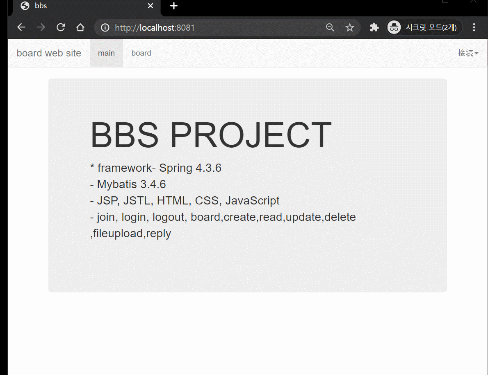
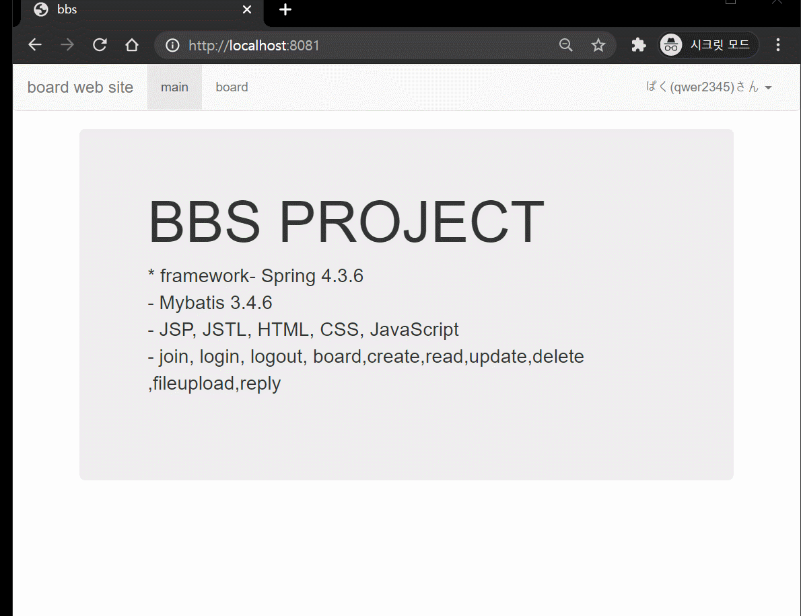
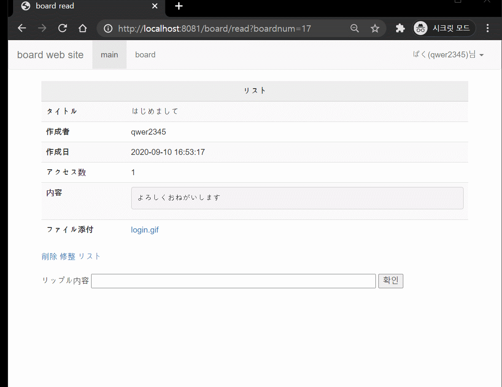
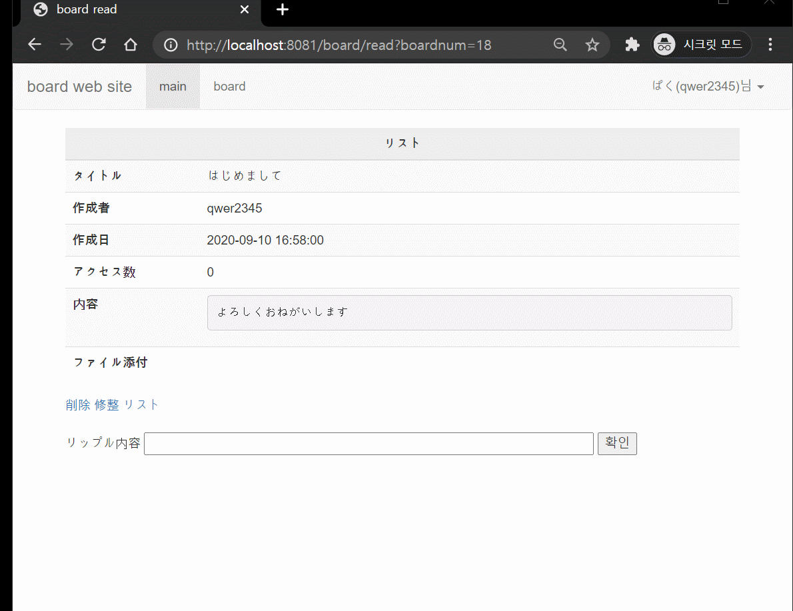
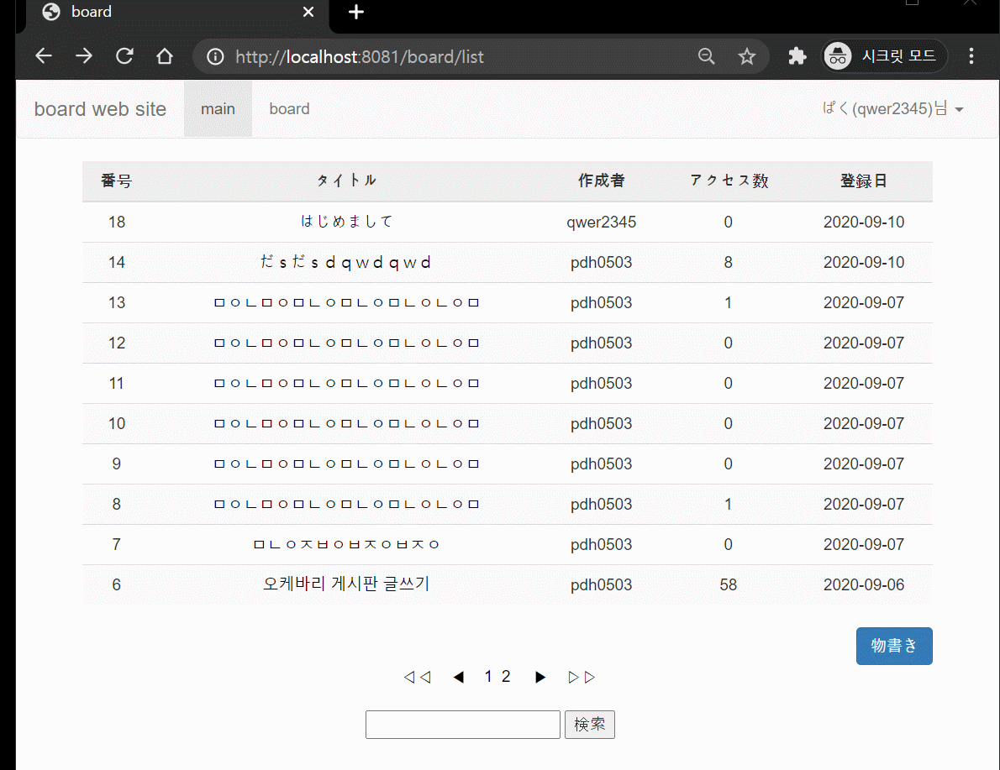

# 掲示板--個人プロジェクト

# 目的

- 新人Web開発者の基本的素養
- どんなwebでも掲示板は必須
- 繰り返しの練習で速くて安定した掲示板を作ることを目指す。

## 開発環境

**Front-End**
- Bootstrap 3

**Back-End**
- Spring 4.3.6
- JDK 1.8
- Oracle
- Mybatis 3.4.6
- Tomcat 9
- Maven 2.9

## プロジェクト要求事項

- モバイル、デスクトップのすべての環境で使用可能です。
 
- サイトにはメンバーというユーザーだけ利用できます。

- ユーザーは会員加入をすることができます。

- メンバーはログインすることができます。

- ログインに成功したら、
  画面右上にメンバーの名前が表示されます。
  
- メンバーは、掲示板で「掲示板の検索」、
 「掲示板の書き込み」機能を利用します。
 
- メンバーは自分が書いたものに対してのみ修正と削除が
  可能です。

## 機能

# join

# login

# board_create

# board_read

# board_update

# board_delete

# reply_create

# board_search

## 保安点

ファイルアップロードダウンロード追加

コメント具現

会員登録、ログイン、書き込み作成の修正有効性検査具現

会員登録成功、ログイン成功、文章作成、修正、削除成功のアラームメッセージを具現

